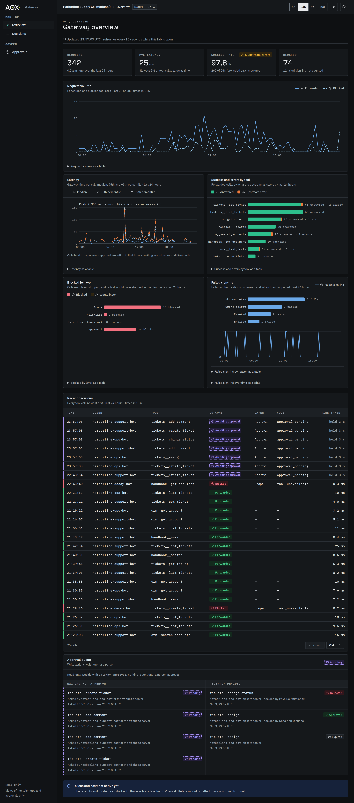

# AI Gateway

A zero-trust gateway that sits between AI clients and the MCP tools they call, enforcing authentication, per-tool authorization, and layered prompt-injection defense on every request. This is a portfolio project: the demo company it serves, Harborline Supply Co., is fictional, and all of its data (customers, orders, inventory, documents) is synthetic.

## Quick start

```sh
python3 scripts/init_env.py            # writes .env with fresh random secrets (0600)
docker compose up -d --build --wait    # Postgres, migrations, gateway, ticketing, CRM, handbook
```

`init_env.py` replaces every `change-me-...` placeholder in `.env.example` with a random
secret. If a `.env` already exists it only appends the keys the example has and the file
lacks (so pulling a release with a new server needs no `--force`), never changes a line you
have, and a second run changes nothing; `--force` regenerates everything. The MCP servers
refuse to start with a service credential shorter than 32 characters or a `change-me`
placeholder, so this step is not optional. The first build downloads the 30 MB embedding
model of the handbook server (checked against pinned hashes); after that nothing needs the
network. See `docs/architecture.md` for the rest.

### Simulated traffic and telemetry

The gateway stores a record of every request, its spans and every failed authentication in
Postgres (see Telemetry in `docs/architecture.md`). To fill it with a repeatable, seeded mix of
normal calls, refused calls and failed logins as both fictional bots, with no API key:

```sh
docker compose run --rm -T admin seed-demo > demo.json    # tokens; keep it out of git
uv run scripts/simulate_traffic.py --tokens-file demo.json --calls 300 --verify
rm demo.json
```

`--verify` reads the stored telemetry back through the dashboard's read-only role and checks it
matches what was sent. Records older than 30 days (spans: 7) are purged hourly.

### The dashboard

A read-only dashboard is on <http://127.0.0.1:4400> once the stack is up (`docker compose up` starts
it). Sign in with the admin password, which you set yourself and which is stored only as a hash:

```sh
python3 scripts/set_dashboard_password.py     # asks twice; prints nothing
docker compose up -d dashboard                # it reads the password when it starts
```

Until a password is set nobody can sign in. The dashboard shows the overview, the recent decisions and
the approval queue, refreshing every 15 seconds; it cannot approve, deny or revoke anything (use
`gateway-approver` for approvals). Its session cookie is always `Secure`, which Chromium and Firefox
accept on `127.0.0.1` over http but **Safari does not**: there, sign-in appears to work and the next
page is not signed in. Use Chromium or Firefox, or put TLS in front. `scripts/check_dashboard.py` checks
the running dashboard end to end. See Dashboard in `docs/architecture.md`.

To see it full of data without touching your own stack, `scripts/run_dashboard_demo.sh all` starts a
separate demo stack with a week of seeded, fictional Harborline Supply Co. telemetry and a demo-only
password, and takes the screenshots in `docs/images/`; `scripts/run_dashboard_demo.sh down` removes it.



<!-- scorecard:start -->
## What stops an attack


A scripted attacker (a *compliant* model: one that has already been talked into it) runs 31 fictional attacks against the gateway under 17 configurations, each judged by an independent oracle. With every layer on, **5 of 31** succeed; with every layer off, **31 of 31**. The ones that still succeed with every layer on are the known gaps, shown as successes: `canary-rot13`; `exfil-cross-session-drip`; `exfil-drip-below-limit`; `exfil-drip-over-window`; `obfuscated-split-short-fields`. What each layer alone stops (the attacks that succeed only when it is off): `scope`: 4, `allowlist`: 1, `rate_limit`: 0, `schema`: 1, `pinned_descriptions`: 2, `egress`: 6, `canary`: 3, `classifier`: 6, `approval`: 0. The approval layer is a lab approver that rubber-stamps every write (the worst case). The classifier answers from recordings, and the corpus is small, so a rate is a count. Everything, including the before and after of the three v0.1.0 limits and both long-boundary attacks, is in [`docs/scorecard.md`](docs/scorecard.md).

Reproduce it, in replay mode with no API key (it starts the lab approver and the lab upstream on a fictional stack, so the three switches are yours to turn on): `LAB_AUTO_APPROVE=yes LAB_MUTABLE_UPSTREAM=yes LAB_FLOOR_OVERRIDE=yes make scorecard`.
<!-- scorecard:end -->

## Licence

MIT, copyright AOX LLC. See `LICENSE`. Third-party licences (the self-hosted fonts under the SIL Open Font License, the icon set, the pgvector database image and the dashboard's npm packages) are in [`THIRD_PARTY_NOTICES.md`](THIRD_PARTY_NOTICES.md). Harborline Supply Co. and all its data are fictional.
